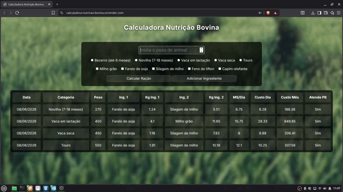

# 🐄 Calculadora de Nutrição Bovina

Ferramenta completa para calcular a necessidade diária de matéria seca e o custo de alimentação de bovinos, com base no peso e categoria do animal. O projeto evoluiu para uma aplicação full-stack com interface Web, mas também mantém sua clássica versão de Linha de Comando (CLI).

A calculadora suporta a seleção de um ou dois ingredientes, realizando o balanceamento automático de proteína pelo método do **Quadrado de Pearson**.

## 💡 Motivação

Projeto desenvolvido para unir conhecimento em Medicina Veterinária com programação, aplicando conceitos reais de nutrição animal em uma ferramenta prática, acessível e open-source para o agronegócio.

## 🌐 Demo
Acesse a versão online: [calculadora-nutricao-bovina.onrender.com](https://calculadora-nutricao-bovina.onrender.com)


## 🚀 Novidades da Versão Web

O projeto agora possui uma interface gráfica no navegador. As principais atualizações incluem:

* **Interface Web (HTML/CSS/JS):** Design responsivo e amigável para o usuário final.
* **Backend em Flask:** Uma API RESTful que gerencia os cálculos e cadastros.
* **Banco de Dados SQLite:** Substituição dos arquivos CSV por um banco de dados relacional utilizando SQLAlchemy (`calculadoranutricaobovina.db`).
* **Comunicação Assíncrona:** O frontend se comunica com a API via `fetch`, garantindo uma experiência fluida sem recarregar a página.

## ⚙️ Funcionalidades Principais (Lógica Nutricional)

* Seleção de categoria animal (bezerro, novilha, vaca em lactação, vaca seca, touro).
* Cálculo da necessidade diária de matéria seca com base no peso vivo.
* Suporte a **1 ou 2 ingredientes** por cálculo.
* Balanceamento automático de proteína pelo **Quadrado de Pearson** quando dois ingredientes são combinados.
* Seleção automática do ingrediente mais econômico quando ambos atendem à exigência proteica.
* Fallback automático para o ingrediente mais proteico quando nenhum atende à exigência mínima.
* Estimativa de custo diário e mensal.
* Alerta visual quando a dieta não atinge a exigência proteica mínima da categoria.
* Histórico automático de cálculos para consulta posterior.

## 🐾 Categorias suportadas

| Categoria | % Matéria Seca | Proteína mínima |
|---|---|---|
| Bezerro (até 6 meses) | 3,0% | 16% |
| Novilha (7–18 meses) | 2,5% | 14% |
| Vaca em lactação | 3,5% | 18% |
| Vaca seca | 2,0% | 12% |
| Touro | 2,2% | 13% |

## 🌾 Alimentos padrões

| Alimento | Proteína (%) | Preço (R$/kg) |
|---|---|---|
| Milho grão | 8,5% | R$ 1,20 |
| Farelo de soja | 45,0% | R$ 3,50 |
| Silagem de milho | 7,0% | R$ 0,35 |
| Feno de tifton | 10,0% | R$ 1,80 |
| Capim-elefante | 9,0% | R$ 0,25 |

## 🔬 Método: Quadrado de Pearson

Quando dois ingredientes são selecionados com proteínas em lados opostos da exigência mínima, o programa utiliza o **Quadrado de Pearson** para calcular as proporções exatas de cada um, garantindo que a mistura atinja precisamente o nível proteico necessário.

```
     45% (farelo de soja)
          \    → 18 - 7 = 11 partes de farelo
    18%    ×
          /    → 45 - 18 = 27 partes de silagem
      7% (silagem de milho)
```

---

## 🛠️ Tecnologias Utilizadas

### Backend & Lógica Matemática

* Python 3
* Flask & Flask-CORS (Criação da API e rotas Web)
* Flask-SQLAlchemy (ORM para manipulação do banco de dados SQLite)
* Pandas (utilizado na versão CLI)

### Frontend

* HTML5
* CSS3
* JavaScript
* Fetch API (consumo do backend)

---

## 💻 Como Executar o Projeto

O repositório conta com duas formas de uso: a **Interface Web** e a **Versão CLI (Terminal)**.

### Pré-requisitos

1. Clone o repositório:

```bash
git clone https://github.com/dmrodrigues-dev/calculadora-nutricao-bovina.git
```

2. Entre na pasta do projeto:

```bash
cd calculadora-nutricao-bovina
```

3. Crie e ative um ambiente virtual (opcional, mas recomendado).

4. Instale as dependências:

```bash
pip install -r requirements.txt
```

---

## 🌐 Opção 1: Rodando a Aplicação Web (Flask)

Para iniciar o servidor backend e acessar a interface gráfica:

Execute o arquivo `app.py`:

```bash
python app.py
```

O servidor será iniciado localmente, geralmente em:

```text
http://localhost:5000
```

ou

```text
http://127.0.0.1:5000
```

Abra a aplicação no navegador e utilize a calculadora.

> **Observação:** O arquivo `script.js` pode estar configurado para consumir uma API publicada. Para rodar localmente, altere as URLs no script.js de https://calculadora-nutricao-bovina.onrender.com para http://localhost:5000.

---


## 💻 Opção 2: Rodando a Versão CLI (Terminal)

Caso prefira utilizar a ferramenta pela linha de comando (que salva os dados em arquivos `.csv` na pasta `cli/`):

Execute:

```bash
python calculadora.py
```

Em seguida, siga as instruções exibidas no terminal.

### 📋 Exemplo de uso

```
=============================================
  🐄 CALCULADORA DE NUTRIÇÃO BOVINA
  Desenvolvido por: Davi Matos Rodrigues
=============================================
arquivo.csv não encontrado, criando arquivo...
Arquivo criado em arquivo.csv
ingredientes.csv não encontrado, criando arquivo...
Arquivo criado em ingredientes.csv

=============================================
  MENU PRINCIPAL
=============================================
  [1] Calcular Ração
  [2] Consultar Histórico
  [3] Cadastrar novo ingrediente
  [4] Sair
=============================================
  Escolha uma opção: 1

=============================================
  CATEGORIA DO ANIMAL
=============================================
  [1] Bezerro (até 6 meses)
  [2] Novilha (7-18 meses)
  [3] Vaca em lactação
  [4] Vaca seca
  [5] Touro
=============================================
  Escolha a categoria: 3
  Informe o peso do animal (kg): 400

=============================================
  TIPO DE ALIMENTO
=============================================
  [1] Milho grão
  [2] Farelo de soja
  [3] Silagem de milho
  [4] Feno de tifton
  [5] Capim-elefante
  [x] Terminar seleção
=============================================
  Escolha o alimento: 1
  Escolha o alimento: 2

=============================================
  RESULTADO DO CÁLCULO
=============================================
  Animal     : Vaca em lactação
  Peso       : 400.0 kg
=============================================
  Matéria seca/dia : 14.00 kg
  Custo diário     : R$ 25.18
  Custo mensal     : R$ 755.42
  Peso de Farelo de soja : KG 3.64
  Peso de Milho grão : KG 10.36
=============================================
  ✅ Atende à exigência proteica mínima
=============================================

  Pressione qualquer tecla para continuar: 

=============================================
  MENU PRINCIPAL
=============================================
  [1] Calcular Ração
  [2] Consultar Histórico
  [3] Cadastrar novo ingrediente
  [4] Sair
=============================================
  Escolha uma opção: 4

=============================================
  Fechando programa...
=============================================
```

---

## 📚 Referências Técnicas

* Nutrient Requirements of Beef Cattle — NRC
* Tabelas de exigências nutricionais para bovinos — Embrapa
* Método do Quadrado de Pearson para balanceamento de rações

---

## 👨‍💻 Autor

**Davi Matos Rodrigues**

* Estudante de Análise e Desenvolvimento de Sistemas — Uninter

### Contato

* GitHub: https://github.com/dmrodrigues-dev
* LinkedIn: https://www.linkedin.com/in/davi-matos-rodrigues-057430268/
